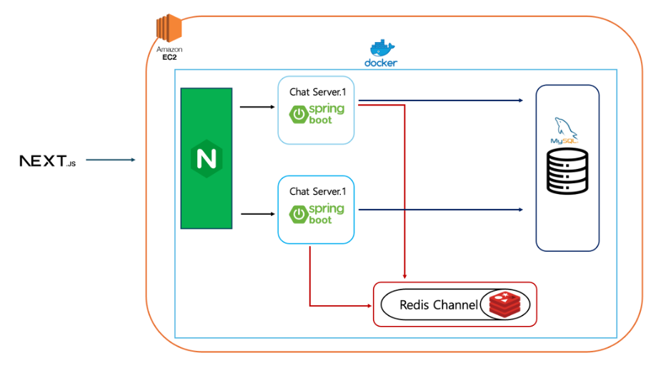

# Team6 실시간 채팅 서비스
Next.JS, SpringBoot, WebSocket 기반의 실시간 채팅 프로젝트 입니다. 소셜 로그인 기반 사용자 인증, 채팅방 생성, 메세지 송수신, 이미지 업로드, 메시지 읽음 처리, 서버 간 동기화까지 포함된 웹 기반 채팅 서비스 입니다.

## 프로젝트 개요
- 개발 기간 : 2025.04 ~ 2025.05
- 팀 구성 : 프론트엔드 1명, 백엔드 1명
- 주요 기능 : 로그인/회원가입, 실시간 채팅, 이미지 전송, 서버 간 동기화

## 기술 스택
**Backend**
- Java / SpringBoot
- SpringSecurity + JWT
- JPA + MySQL
- Redis (Redis pub/sub)
- AWS SDK2 (S3 Presigned URL)
- Swagger API

**Infrastructure**
- Docker + Docker Compose
- AWS EC2 (Ubuntu 22.04)
- Nginx

## 주요 기능
- 소셜 로그인 (카카오) + JWT 인증/인가
- STOMP 기반 WebSocket 실시간 채팅
- Redis pub/sub을 이용한 서버 간 메시지 브로드캐스팅
- 실시간 메시지 읽음 상태 처리
- AWS S3 Presigned URL 방식 이미지 전송
- Docker Compose 기반 EC2 배포 및 Nginx 리버스 프록시 구성

## 시스템 구성도
- EC2 하나에 Docker Compose를 이용해 다음 구성 요소를 함께 배포:
    - chat-server (Spring Boot) 2개 인스턴스
    - Redis (pub/sub, 캐시)
    - MySQL (DB)
    - Nginx (리버스 프록시)
- Redis pub/sub을 통해 두 서버 간 메시지 동기화 처리
- WebSocket이 연결된 서버와 상관없이 메시지 브로드캐스트 가능

## 트러블 슈팅
- **Redis에 null 키 저장**
    - 문제: Redis에 null 키가 저장되어 있어서 안읽은 메시지 수 계산이 꼬임
    - 원인: 테스트 도중 userId, roomId가 null인 상태로 접근
    - 해결: Redis key 생성전 null 체크 추가, 디버깅 중에는 keys * 로 직접 삭제

## 프로젝트 회고
- **배운 점**
    - Redis pub/sub을 이용한 멀티 서버간 메시지 브로드캐스트 구조 경험
    - 소셜 로그인 기반 사용자 인증 경험
    - 첫 Presigend URL 방식의 이미지 업로드 흐름 구현

- **아쉬운 점**
    - STOMP에 대한 이해 및 숙련도의 부족과 개발 기간의 부족으로 실시간 통신 부분 Controller, Service간 역할과 책임을 명확하게 나누지 못한 점
    - 메시지 흐름이 Controller 레이어에 집중 되면서 비즈니스 로직과 통신 처리 로직이 혼재된 점

